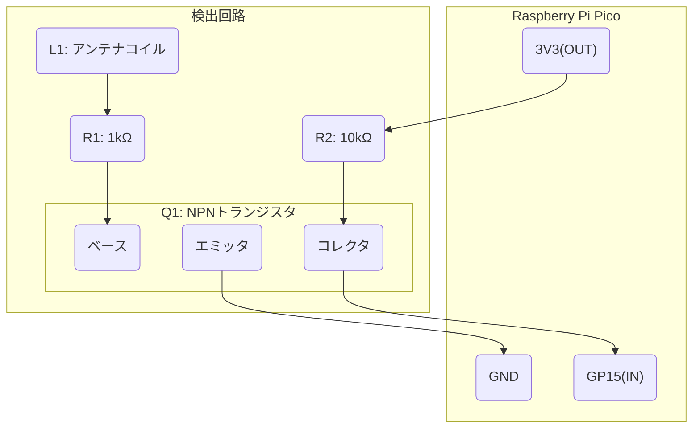

```mermaid
graph TD
    subgraph Raspberry Pi Pico
        Pico_3V3("3V3(OUT)")
        Pico_GND("GND")
        Pico_GP15("GP15(IN)")
    end

    subgraph 検出回路
        subgraph Q1: NPNトランジスタ
            B(ベース)
            C(コレクタ)
            E(エミッタ)
        end
        L1("L1: アンテナコイル")
        R1("R1: 1kΩ")
        R2("R2: 10kΩ")
    end

    %% 正しい配線
    Pico_3V3 --> R2
    R2 --> C
    C --> Pico_GP15
    L1 --> R1 --> B
    E --> Pico_GND
```
